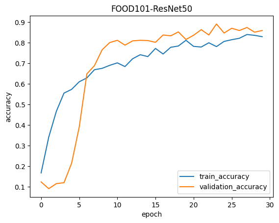
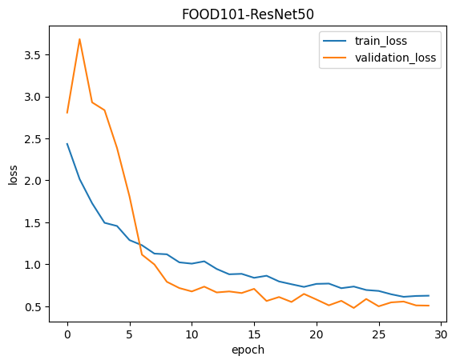

# Food Classification Using ResNet50 on Food-101 Dataset

## Overview
This project involves building a food classification model using the Food-101 dataset and fine-tuning a pre-trained ResNet50 model. The goal is to accurately classify food images into one of 10 categories, demonstrating the effectiveness of transfer learning in image recognition tasks.

## Table of Contents
- [Accomplishments](#accomplishments)
- [Dataset](#dataset)
- [Metrics](#metrics)
- [Results](#results)
- [Use Cases](#use-cases)
- [Improvements](#improvements)
- [Installation](#installation)
- [Usage](#usage)


## Accomplishments
- Successfully fine-tuned the ResNet50 model on the Food-101 dataset, achieving a high accuracy rate.
- Developed a workflow to preprocess, train, validate, and evaluate the model using TensorFlow and Keras.
- Implemented data augmentation techniques to improve model robustness and generalization.
- Visualized training and validation accuracy/loss over epochs for performance analysis.

## Dataset
The Food-101 dataset consists of 101,000 images of food, categorized into 101 classes, with 1,000 images per class. For this project, a subset of 3 classes was used for quick experimentation. The dataset was processed to create training and testing splits.

### Dataset Structure
```
food-101/
│
├── images/
│   ├── class1/
│   ├── class2/
│   └── class3/
├── meta/
│   ├── train.txt
│   └── test.txt
```

- The dataset used for training the model can be found [here](https://www.kaggle.com/datasets/dansbecker/food-101).


## Metrics
The performance of the model was evaluated using the following metrics:
- **Accuracy:** The proportion of correctly predicted instances.
- **Loss:** The categorical cross-entropy loss calculated during training.

## Results
- **Training Accuracy:** 81.68% (final epoch)
- **Validation Accuracy:** 85.87% (final epoch)
- **Training Loss:** 0.6370 (final epoch)
- **Validation Loss:** 0.5090 (final epoch)


## Accuracy vs Epoch
  
## Loss vs Epoch
  

## Use Cases
- **Food Recognition:** The model can classify food images, aiding applications in food delivery, restaurant menus, and food bloggers.
- **Nutritional Analysis:** Coupling the classification with nutritional information from the USDA API could help users understand calorie content and nutritional value.
- **Dietary Recommendations:** The model can be integrated into apps for providing dietary suggestions based on food classification.

## Improvements
To enhance the model’s performance and applicability, the following improvements are suggested:
1. **Expanding Classes:** Including more food categories to improve the model's versatility. However, this is computationally intensive and may require more resources.
2. **Hyperparameter Tuning:** Experimenting with different learning rates, batch sizes, and optimizer settings to maximize performance.
3. **Integrating USDA API:** Utilize the USDA API to fetch nutritional information about the classified foods, providing additional value to the users.
4. **Ensemble Learning:** Combining multiple models to improve classification accuracy and robustness.

### USDA API Integration
Integrating the USDA API can allow the application to provide nutritional information based on classified food items, enhancing the overall user experience. This includes calories, macronutrient content, and recommended serving sizes.


## Installation

### Clone the repository

```bash
git clone https://github.com/Hrishabh-V/PRODIGY_ML_05.git
cd PRODIGY_ML_05
```


To set up the environment, install the required packages using pip:

```bash
pip install tensorflow keras matplotlib opencv-python customtkinter
```

### Prerequisites

- Python 3.10
- TensorFlow
- Keras
- Tkinter
- PIL (Pillow)

## Usage
To run the application, simply execute the following command:

```bash
python app.py
```

This will start the application and provide an interface for users to upload images for food classification.